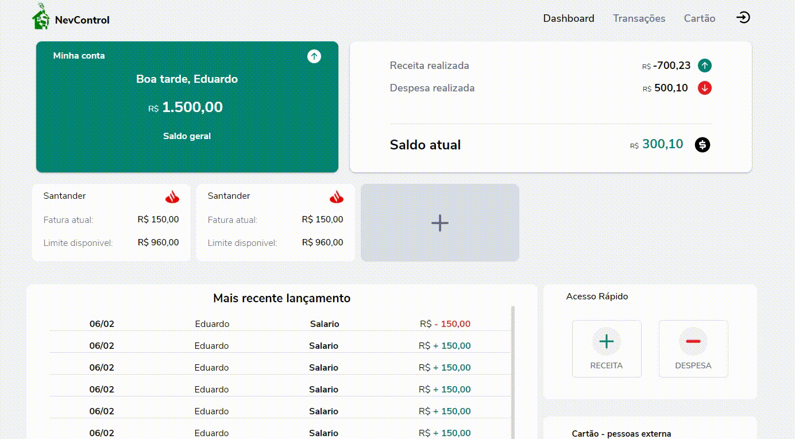

## PROJETO - CONTROLE FINANCEIRO PESSOAL

## Site em desenvolvimento...

---

### Demonstração do site

https://nev-front.herokuapp.com/

<h1 align="center">
    
</h1>

Sistema foi desenhado para facilitar controle de todos os gastos pessoas, tanto cartão de credito como conta, intuito e com poucos clique ter o controle do dinheiro.

## Tecnologias Usadas:

Reactjs :

- react-router-dom,
- styled-components,
- react-modal,
- styled-icons,
- formik,
- yup,
- react-toastify

Node js :

- bcrypt,
- bcryptjs,
- express,
- jsonwebtoken,
- mongoose,
- morgan

---

## Como baixar o projeto

```bash
#Clona repositório
$ git clone https://github.com/edpedro/NevControl.git

#Entra nos diretórios
$ cd NevControl

#Entra nas pasta web e server, instalar dependência
$ yarn

#Inicia o projeto
$ yarn start - web
$ yarn dev - server

```

Desenvolvido por Eduardo Pedro, Edp2013.ep@gmail.com
