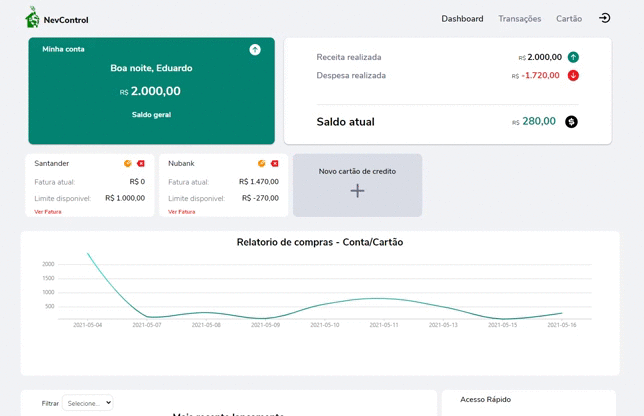
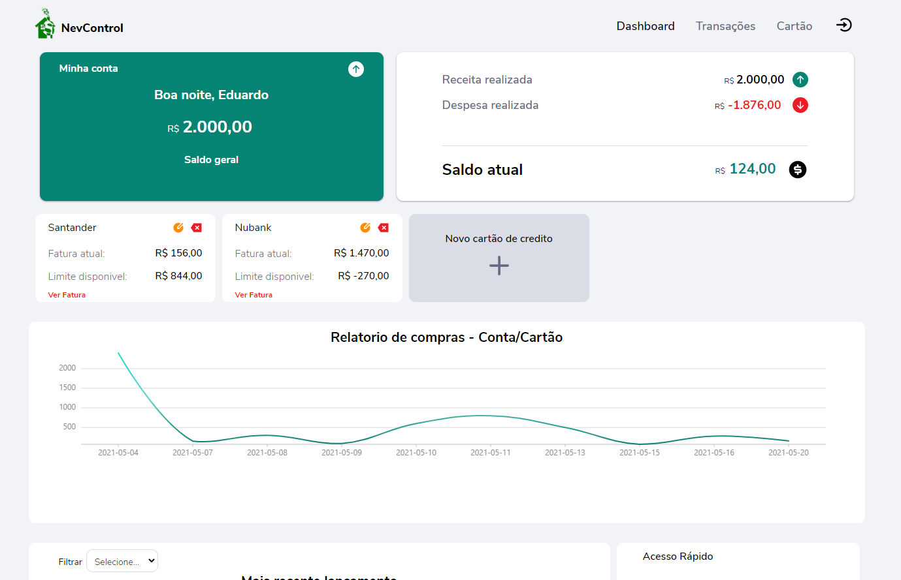
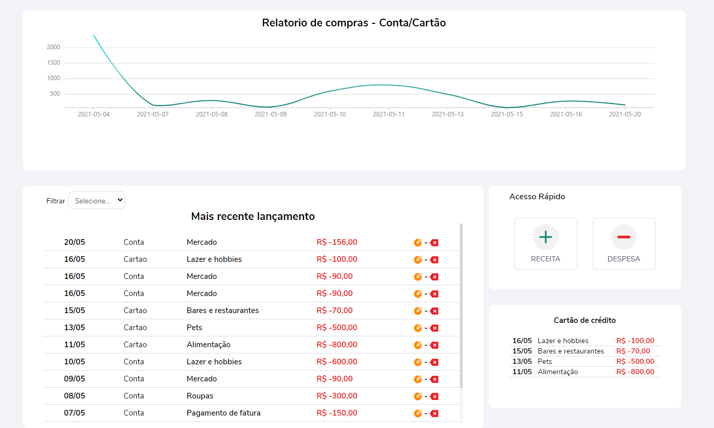
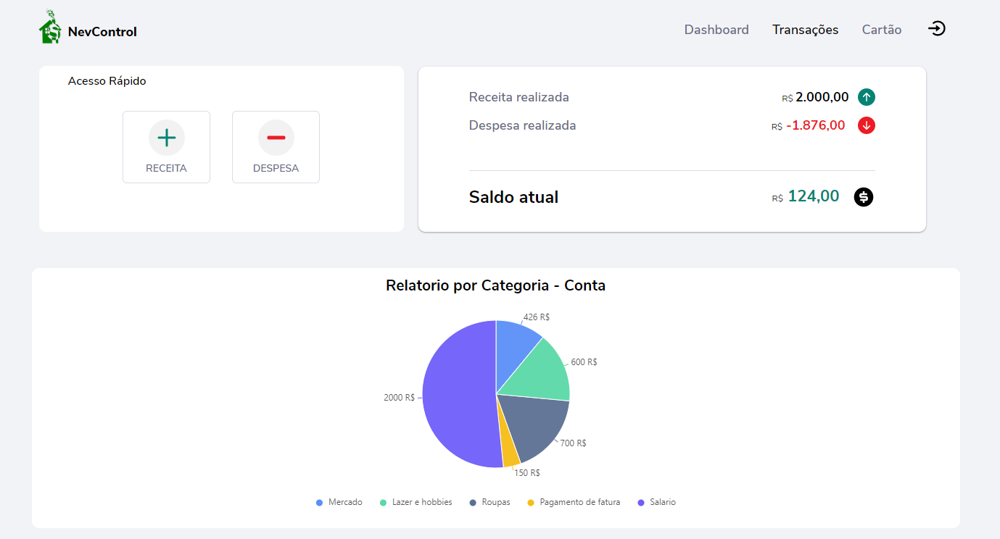
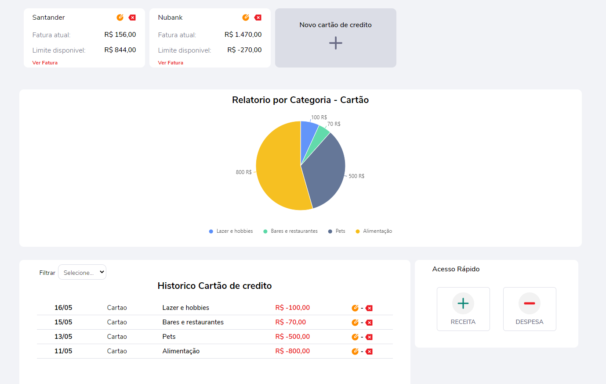
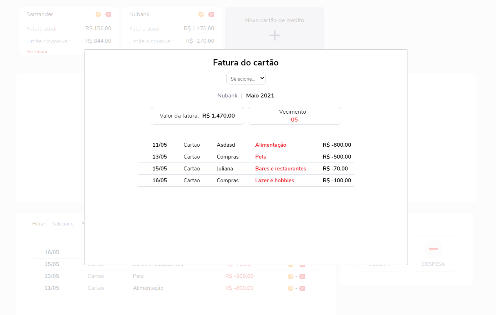
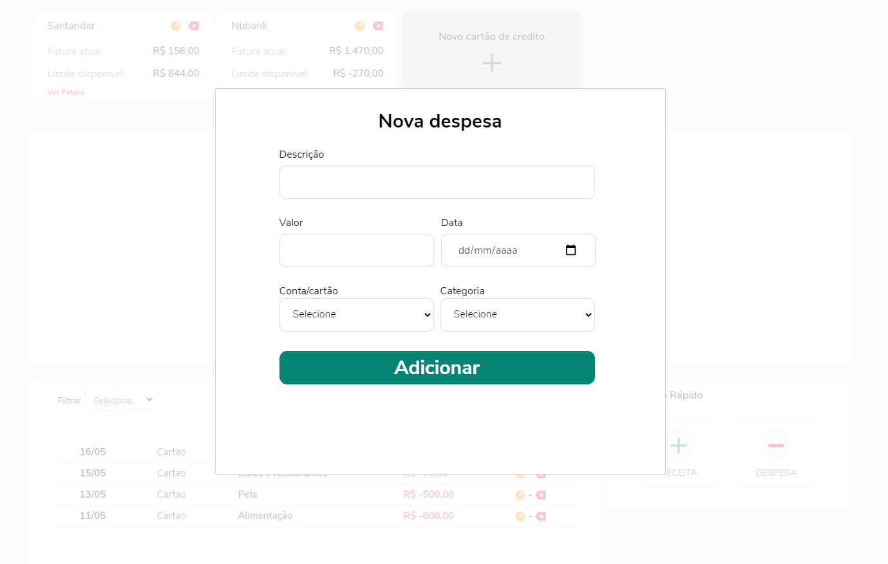
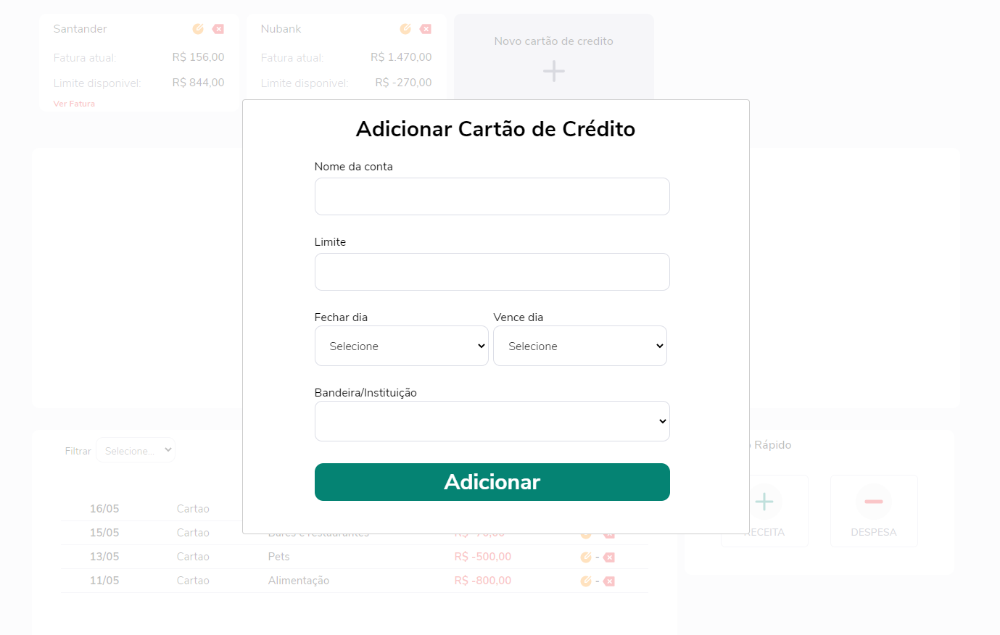
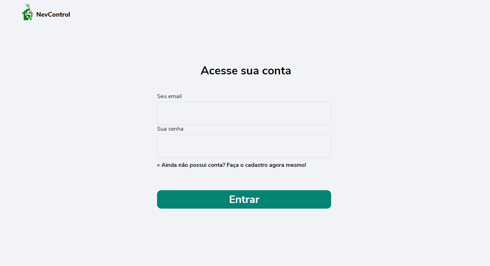
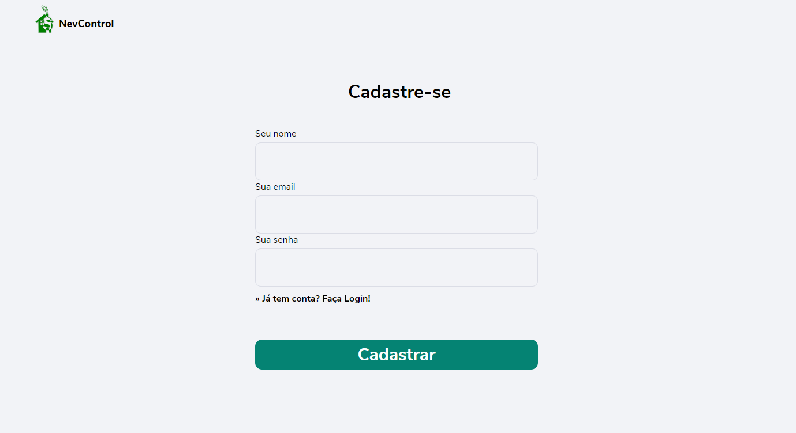

<h2 align="center">
   CONTROLE FINANCEIRO PESSOAL
</h2>
<br>
<h1 align="center">
    
</h1>

<h3 align="center">
    <a href="https://nev-front.herokuapp.com/">🔗 Acessar a demonstração</a>
<h3 >

# Indice

- [Sobre](#-sobre)
- [Tecnologias Utilizadas](#-tecnologias-utilizadas)
- [Google Authenticated](#-google-authenticated)
- [Como baixar o projeto](#-como-baixar-o-projeto)
- [Deploy](#-deploy)
- [Imagens](#-imagens)

<br>

## 🔖&nbsp; Sobre

O sistema **NevControl** foi desenhado para ser intuitivo e tornar sua experiência cada vez mais natural. Com poucos cliques você consegue fazer um controle incrível do seu dinheiro!

---

## 🚀 Tecnologias utilizadas

Reactjs :

- Context Api,
- Axios,
- react-router-dom,
- styled-components,
- react-modal,
- styled-icons,
- formik,
- yup,
- react-toastify
- bizcharts

Nodejs :

- bcrypt,
- bcryptjs,
- express,
- jsonwebtoken,
- mongoose,
- morgan

---

<br>

## 💼 Google Authenticated

### web

- react-google-login

### server

- google-auth-library

---

<br>

## 🗂 Como baixar o projeto

```bash

    # Clonar o repositório
    $ git clone https://github.com/edpedro/NevControl.git

    # Entrar no diretório
    $ cd web
    $ cd server

    # Instalar as dependências
    $ yarn install

    # Iniciar o projeto
    $ cd web - yarn start
    $ cd server - yarn dev
```

## 🚧 Deploy

Heroku

- Nodejs
- Reactjs

MongoDB Cloud

- NoSql

---

<br>

## 🎁 Imagens

<br>

<h1 align="center">
    
    
    
    
    
    
    
    
    
    
   
</h1>

---

Desenvolvido 💜 por Eduardo Pedro, Edp2013.ep@gmail.com
